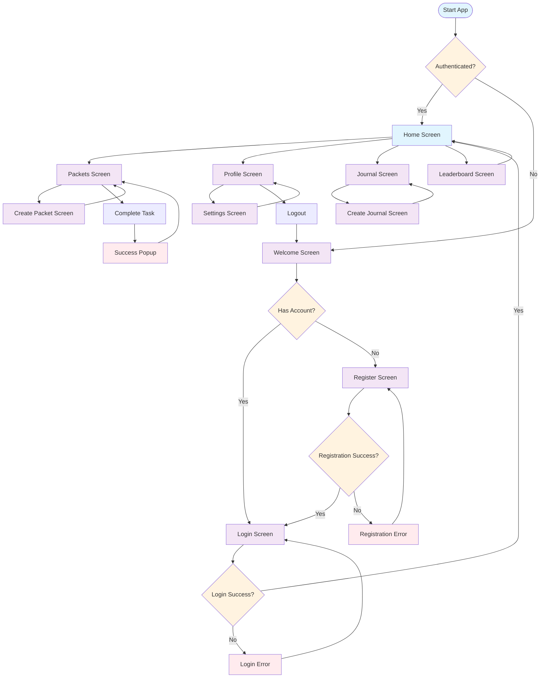

# Raksana App User Flow - Mermaid Syntax

## Complete Mermaid Flowchart

## How to Use This Mermaid Flowchart in Draw.io

### Step 1: Open Draw.io
1. Go to [app.diagrams.net](https://app.diagrams.net) (formerly draw.io)
2. Choose where to save your diagram (Device, Google Drive, OneDrive, etc.)
3. Click "Create New Diagram"

### Step 2: Import Mermaid Code
1. In the new diagram window, go to **Arrange** → **Insert** → **Advanced** → **Mermaid**
2. Copy the entire mermaid code block above (from `flowchart TD` to the last line)
3. Paste it into the Mermaid dialog box
4. Click **Insert**

### Step 3: Customize Your Flowchart
**Colors & Styling:**
- Right-click any shape → **Edit Style**
- Change colors: `fillColor=#E8F5E8;strokeColor=#4CAF50`
- Modify text: Double-click any shape to edit text

**Layout Adjustments:**
- Drag shapes to reposition
- Use **Arrange** → **Layout** → **Hierarchical** for auto-layout
- Adjust spacing with **Layout** → **Grid Size**

**Professional Touches:**
- Add your app logo: **Insert** → **Image**
- Change background: Right-click canvas → **Page Setup** → **Background**
- Add title: **Insert** → **Text**

### Step 4: Export Your Flowchart
1. **File** → **Export as** → Choose format:
   - **PNG**: For presentations/documents
   - **SVG**: For web/scalable graphics
   - **PDF**: For printing/sharing
2. Adjust quality settings if needed
3. Click **Export**

### Alternative: Manual Creation
If Mermaid import doesn't work:
1. Use **More Shapes** → **Flowchart** from left panel
2. Drag shapes: Rectangle (screens), Diamond (decisions), Circle (start/end)
3. Connect with arrows from **General** shapes
4. Follow the flow structure from the Mermaid code above

### Mermaid Syntax Quick Reference
- `[Text]` = Rectangle (screens)
- `{Text}` = Diamond (decisions) 
- `-->` = Arrow connection
- `-->|Label|` = Labeled arrow
- `TD` = Top Down direction
