# Raksana App User Flow - Complete Mermaid Syntax

## Complete User Experience Flowchart

### Recent Updates (v2.0)
- **New Onboarding System**: Added comprehensive onboarding flow after registration
- **Token-Based Registration**: Registration now automatically saves authentication token
- **Guided First Packet Creation**: New users create their first packet as part of onboarding
- **Enhanced User Journey**: Smoother transition from registration to main app usage

### Key Changes:
1. **Registration Flow**: Now redirects to onboarding instead of login
2. **Onboarding Screen**: Two-step process (Welcome → Create Packet)
3. **Automatic Authentication**: Users are logged in immediately after registration
4. **First Packet Creation**: Mandatory packet creation during onboarding

```mermaid
---
config:
    theme: redux
---
flowchart TD
    %% Authentication Flow
    START([Start App]) --> FASTAUTH{Fast Auth Check}
    FASTAUTH -->|Authenticated| HOME[🏠 Home Screen]
    FASTAUTH -->|Not Authenticated| WELCOME[👋 Welcome Screen]
    
    WELCOME --> HASACCT{Has Account?}
    HASACCT -->|Yes| LOGIN[🔐 Login Screen]
    HASACCT -->|No| REGISTER[📝 Register Screen]
    
    LOGIN --> LOGINOK{Login Success?}
    LOGINOK -->|Yes| HOME
    LOGINOK -->|No| LERROR[❌ Login Error]
    LERROR --> LOGIN
    
    REGISTER --> REGOK{Registration Success?}
    REGOK -->|Yes| ONBOARDING[🌟 Onboarding Screen]
    REGOK -->|No| RERROR[❌ Registration Error]
    RERROR --> REGISTER
    
    %% Onboarding Flow
    ONBOARDING --> ONBOARDSTEP{Onboarding Step}
    ONBOARDSTEP -->|Welcome| WELCOME_STEP[👋 Welcome & Features]
    ONBOARDSTEP -->|Create Packet| CREATE_STEP[📝 Create First Packet]
    
    WELCOME_STEP --> CREATE_STEP
    CREATE_STEP --> PACKET_CREATED{Packet Created?}
    PACKET_CREATED -->|Yes| HOME
    PACKET_CREATED -->|No| PACKET_ERROR[❌ Packet Creation Error]
    PACKET_ERROR --> CREATE_STEP
    
    %% Main Tab Navigation (Bottom Tabs)
    HOME --> PACKETS[📁 Habit/Packets Tab]
    HOME --> QR[📱 QR Scanner Tab]
    HOME --> EXPLORE[🧭 Explore Tab]
    HOME --> PROFILE[👤 Yard/Profile Tab]
    
    %% Home Screen Quick Actions
    HOME --> JOURNAL[📖 Journal Screen]
    HOME --> ALBUM[📸 Album/Memory Screen]
    HOME --> EVENTS[📅 Events Screen]
    HOME --> CHALLENGES[🏆 Challenges Screen]
    HOME --> LEADERBOARD[👑 Leaderboard Screen]
    HOME --> RECAPS[📊 Recaps Screen]
    HOME --> RECYCLOPEDIA[♻️ Recyclopedia Screen]
    HOME --> NEARBYQUEST[🎯 Nearby Quest Locator]
    
    %% Packets/Habits Flow
    PACKETS --> PACKETDETAIL[📋 Packet Detail Screen]
    PACKETS --> CREATEPKT[➕ Create Packet Screen]
    PACKETDETAIL --> COMPLETETASK[✅ Complete Task]
    CREATEPKT --> PACKETS
    COMPLETETASK --> TASKPOPUP[🎉 Success Popup]
    TASKPOPUP --> UNLOCKCHECK{Packet Unlocked?}
    UNLOCKCHECK -->|Yes| UNLOCKPOPUP[🔓 Unlock Popup]
    UNLOCKCHECK -->|No| PACKETS
    UNLOCKPOPUP --> PACKETS
    
    %% QR Scanner Flow
    QR --> SCANRESULT[📊 Scan Result]
    SCANRESULT --> HOME
    
    %% Explore Flow
    EXPLORE --> USERPROFILE[👥 User Profile View]
    USERPROFILE --> USERTABS{Profile Tabs}
    USERTABS --> USERSTATISTICS[📈 User Statistics]
    USERTABS --> USERJOURNALS[📝 User Journals]
    USERTABS --> USERALBUMS[🖼️ User Albums]
    USERTABS --> USERTIMELINE[🗺️ User Timeline]
    
    %% Profile/Yard Flow
    PROFILE --> PROFILETABS{Profile Tabs}
    PROFILETABS --> STATISTICS[📈 Statistics Tab]
    PROFILETABS --> TREASURES[💎 Treasures Tab]
    PROFILETABS --> TIMELINE[🗺️ Timeline Tab]
    PROFILE --> EDITPROFILE[✏️ Edit Profile]
    PROFILE --> LOGOUT[🚪 Logout]
    EDITPROFILE --> PROFILE
    LOGOUT --> WELCOME
    
    %% Timeline Interaction
    TIMELINE --> TIMELINEDETAIL[📍 Activity Detail]
    TIMELINEDETAIL --> TIMELINE
    USERTIMELINE --> USERTIMELINEDETAIL[📍 User Activity Detail]
    USERTIMELINEDETAIL --> USERTIMELINE
    
    %% Journal Flow
    JOURNAL --> CREATEJOURNAL[✍️ Create Journal Entry]
    CREATEJOURNAL --> JOURNAL
    
    %% Album/Memory Flow
    ALBUM --> CREATEMEMORY[📷 Create Memory]
    CREATEMEMORY --> ALBUM
    
    %% Events Flow
    EVENTS --> EVENTTABS{Event Tabs}
    EVENTTABS --> ALLEVENTS[📅 All Events]
    EVENTTABS --> UPCOMING[⏰ Upcoming Events]
    EVENTTABS --> ONGOING[▶️ Ongoing Events]
    EVENTTABS --> ENDED[✅ Ended Events]
    
    ALLEVENTS --> EVENTDETAIL[📋 Event Detail]
    UPCOMING --> EVENTDETAIL
    ONGOING --> EVENTDETAIL
    ENDED --> EVENTDETAIL
    
    EVENTDETAIL --> EVENTREGISTER[📝 Event Registration]
    EVENTDETAIL --> EVENTMAP[🗺️ Event Location]
    EVENTREGISTER --> EVENTDETAIL
    EVENTMAP --> EVENTDETAIL
    
    EVENTS --> PENDINGEVENTS[⏳ Pending Events]
    PENDINGEVENTS --> EVENTDETAIL
    
    %% Challenges Flow
    CHALLENGES --> CHALLENGEDETAIL[🏆 Challenge Detail]
    CHALLENGEDETAIL --> CHALLENGEPARTICIPANTS[👥 Challenge Participants]
    CHALLENGEPARTICIPANTS --> CHALLENGEDETAIL
    
    %% Leaderboard Flow
    LEADERBOARD --> LEADERBOARDUSER[👤 Leaderboard User Profile]
    LEADERBOARDUSER --> LEADERBOARD
    
    %% Recaps Flow
    RECAPS --> WEEKLYRECAP[📊 Weekly Recap]
    RECAPS --> MONTHLYRECAP[📈 Monthly Recap]
    WEEKLYRECAP --> RECAPS
    MONTHLYRECAP --> RECAPS
    
    %% Additional Screens
    RECYCLOPEDIA --> HOME
    NEARBYQUEST --> QUESTFOUND[🎯 Quest Found Popup]
    QUESTFOUND --> HOME
    
    %% Return Navigation
    JOURNAL --> HOME
    ALBUM --> HOME
    EVENTS --> HOME
    CHALLENGES --> HOME
    LEADERBOARD --> HOME
    RECAPS --> HOME
    RECYCLOPEDIA --> HOME
    
    %% Styling
    classDef startEnd fill:#e1f5fe,stroke:#01579b,stroke-width:3px
    classDef mainScreen fill:#e8f5e8,stroke:#2e7d32,stroke-width:2px
    classDef tabScreen fill:#fff3e0,stroke:#f57c00,stroke-width:2px
    classDef detailScreen fill:#f3e5f5,stroke:#7b1fa2,stroke-width:2px
    classDef decision fill:#fff8e1,stroke:#f9a825,stroke-width:2px
    classDef popup fill:#ffebee,stroke:#c62828,stroke-width:2px
    classDef action fill:#e0f2f1,stroke:#00695c,stroke-width:2px
    
    class START,HOME startEnd
    class WELCOME,LOGIN,REGISTER,ONBOARDING mainScreen
    class PACKETS,QR,EXPLORE,PROFILE tabScreen
    class JOURNAL,ALBUM,EVENTS,CHALLENGES,LEADERBOARD,RECAPS,RECYCLOPEDIA detailScreen
    class FASTAUTH,HASACCT,LOGINOK,REGOK,UNLOCKCHECK,PROFILETABS,EVENTTABS,USERTABS,ONBOARDSTEP,PACKET_CREATED decision
    class LERROR,RERROR,TASKPOPUP,UNLOCKPOPUP,QUESTFOUND,PACKET_ERROR popup
    class CREATEPKT,CREATEJOURNAL,CREATEMEMORY,EVENTREGISTER,EDITPROFILE,WELCOME_STEP,CREATE_STEP action
```

## How to Use This Mermaid Flowchart in Draw.io

### Step 1: Open Draw.io
1. Go to [app.diagrams.net](https://app.diagrams.net) (formerly draw.io)
2. Choose where to save your diagram (Device, Google Drive, OneDrive, etc.)
3. Click "Create New Diagram"

### Step 2: Import Mermaid Code
1. In the new diagram window, go to **Arrange** → **Insert** → **Advanced** → **Mermaid**
2. Copy the entire mermaid code block above (from `flowchart TD` to the last line)
3. Paste it into the Mermaid dialog box
4. Click **Insert**

### Step 3: Customize Your Flowchart
**Colors & Styling:**
- Right-click any shape → **Edit Style**
- Change colors: `fillColor=#E8F5E8;strokeColor=#4CAF50`
- Modify text: Double-click any shape to edit text

**Layout Adjustments:**
- Drag shapes to reposition
- Use **Arrange** → **Layout** → **Hierarchical** for auto-layout
- Adjust spacing with **Layout** → **Grid Size**

**Professional Touches:**
- Add your app logo: **Insert** → **Image**
- Change background: Right-click canvas → **Page Setup** → **Background**
- Add title: **Insert** → **Text**

### Step 4: Export Your Flowchart
1. **File** → **Export as** → Choose format:
   - **PNG**: For presentations/documents
   - **SVG**: For web/scalable graphics
   - **PDF**: For printing/sharing
2. Adjust quality settings if needed
3. Click **Export**

### Alternative: Manual Creation
If Mermaid import doesn't work:
1. Use **More Shapes** → **Flowchart** from left panel
2. Drag shapes: Rectangle (screens), Diamond (decisions), Circle (start/end)
3. Connect with arrows from **General** shapes
4. Follow the flow structure from the Mermaid code above

### Mermaid Syntax Quick Reference
- `[Text]` = Rectangle (screens)
- `{Text}` = Diamond (decisions) 
- `-->` = Arrow connection
- `-->|Label|` = Labeled arrow
- `TD` = Top Down direction
